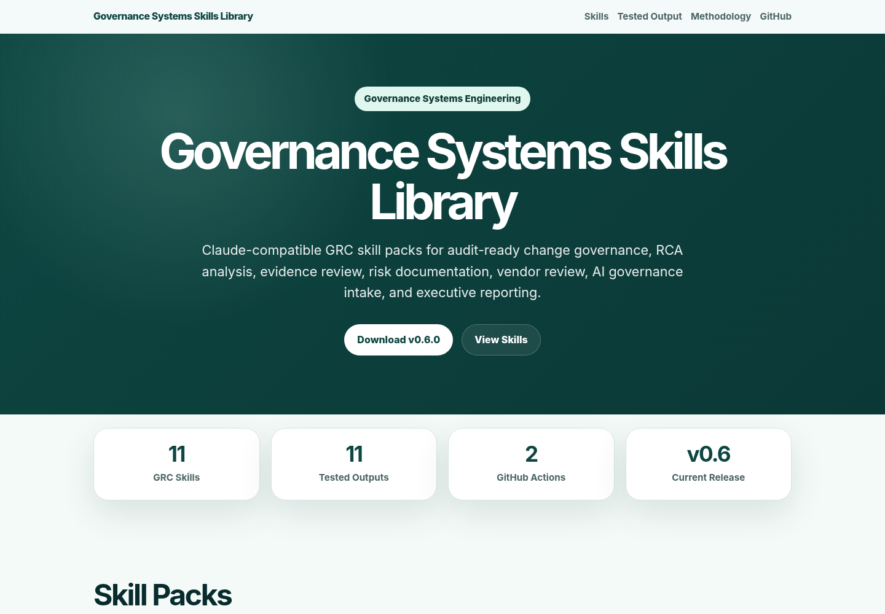
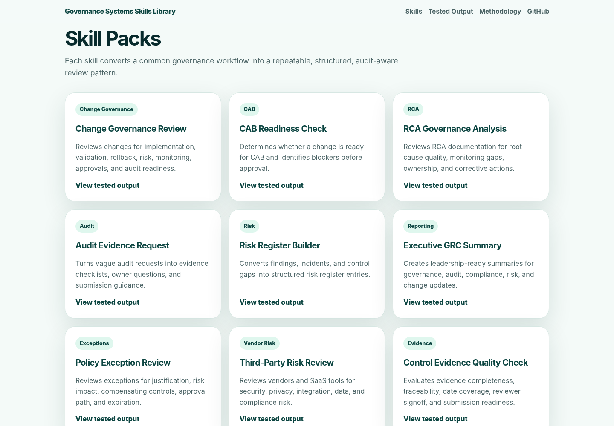
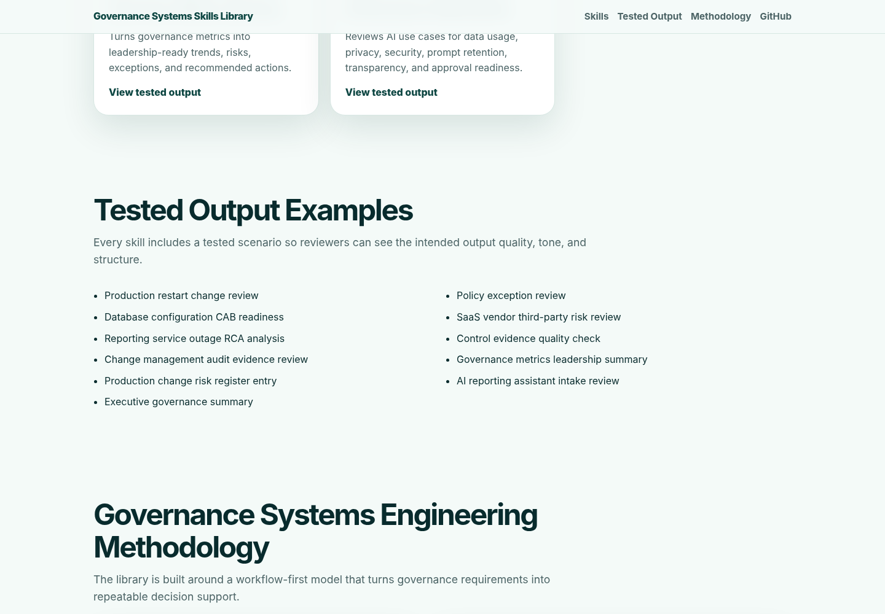
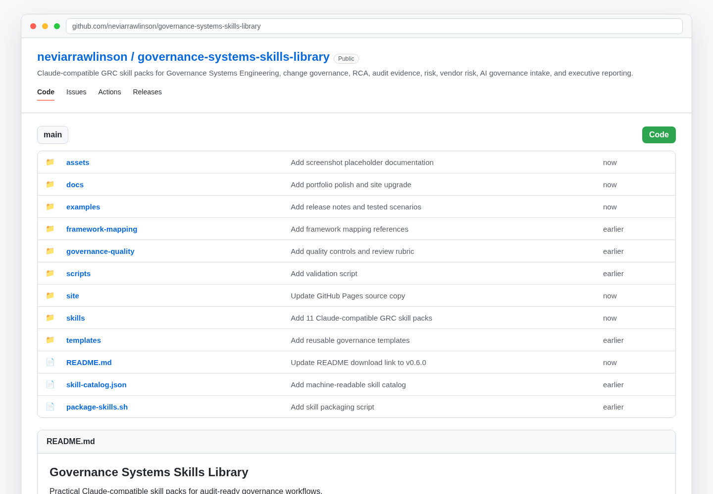
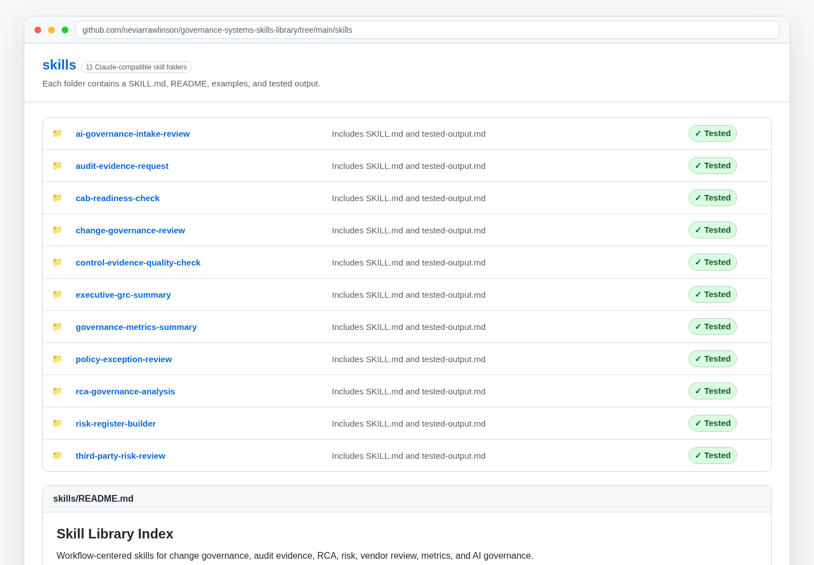
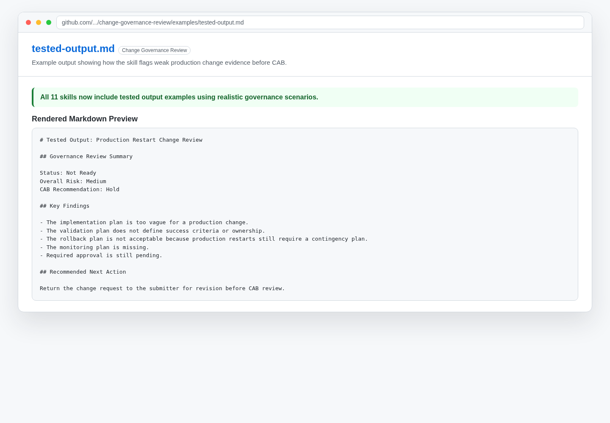
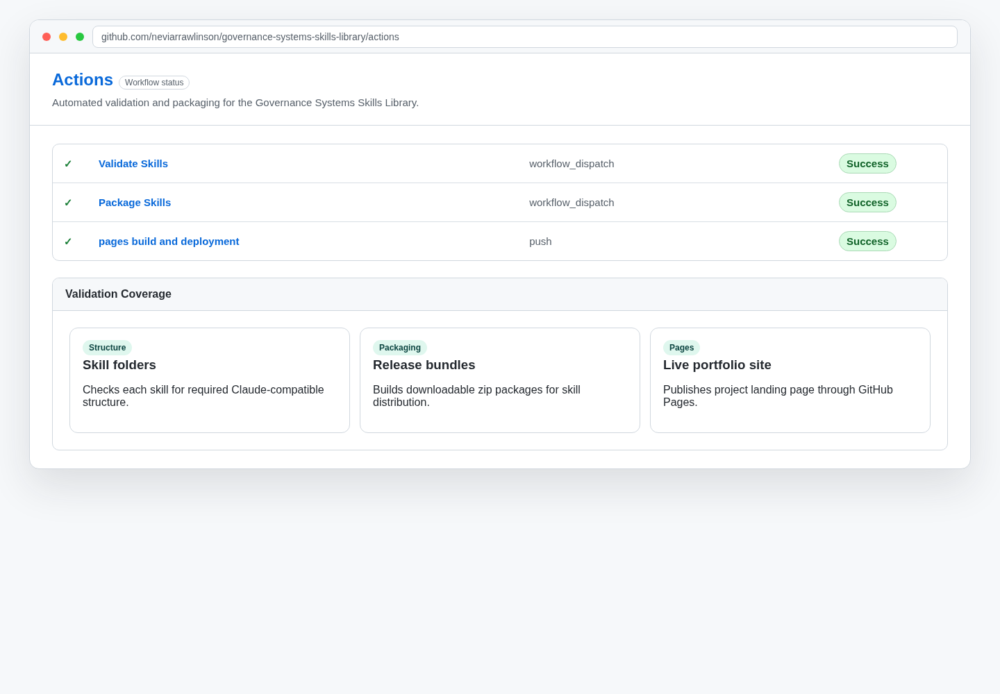
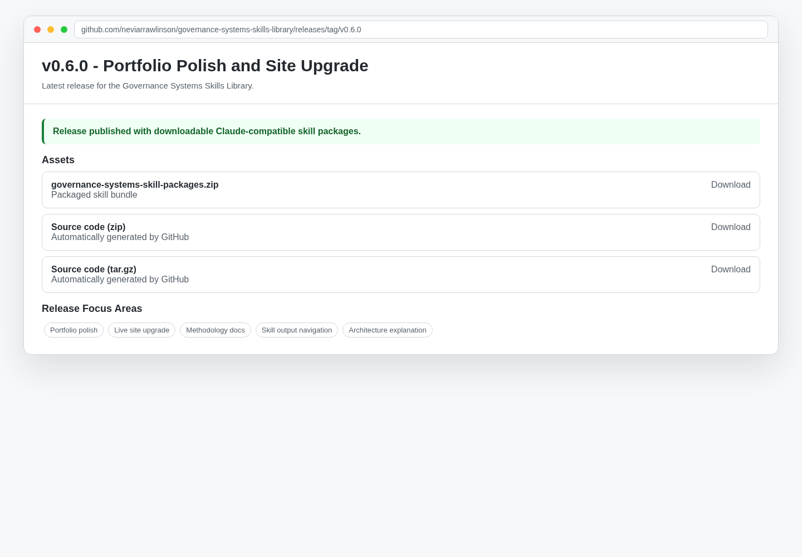
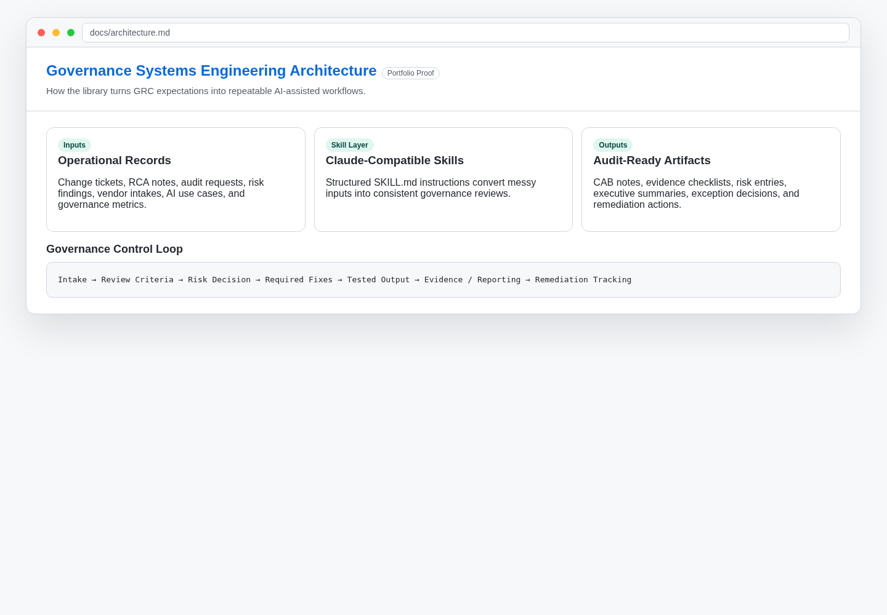

# Governance Systems Skills Library

Practical Claude-compatible skill packs for Governance Systems Engineering, change governance, RCA analysis, audit evidence, risk documentation, vendor risk, AI governance intake, and executive GRC reporting.

## Live Demo

View the project landing page here:

https://neviarrawlinson.github.io/governance-systems-skills-library/

## Project Preview

### Live Landing Page



### Skill Library Overview



### Tested Output Examples



### Repository Structure



### Skills Folder Structure



### Tested Skill Output Example



### Validation Workflow



### Release Assets



### Architecture and Methodology



## Why This Project Exists

Many governance programs fail because controls live in documents but do not show up consistently in tickets, approvals, evidence, reporting, or operational decisions.

Governance Systems Engineering turns governance expectations into repeatable systems, decision logic, checklists, workflows, skill packs, and audit-ready outputs.

This project was created to demonstrate how GRC work can move beyond static documentation and become a structured, repeatable, AI-assisted governance workflow.

## What Makes This Different

This is not a generic framework reference library. This project is workflow-centered and focuses on the work practitioners actually perform:

- Reviewing technology change requests
- Preparing CAB decisions
- Evaluating RCA quality
- Checking audit evidence before submission
- Creating risk register entries
- Reviewing policy exceptions
- Assessing third-party risk
- Summarizing governance metrics
- Reviewing AI use cases before approval
- Producing executive-ready GRC summaries

## Download Skill Packages

The latest packaged Claude-compatible skill bundle is available from the official GitHub release:

[Download governance-systems-skill-packages.zip](https://github.com/neviarrawlinson/governance-systems-skills-library/releases/tag/v0.7.0)

Current release: **v0.7.0 - Screenshots and Portfolio Proof**

## Getting Started

Use these guides to download, install, test, and apply the skills:

- [Quickstart Guide](docs/quickstart.md)
- [Installation and Usage Guide](docs/installation-and-usage-guide.md)
- [User Guide](docs/user-guide.md)
- [Skill Testing Prompt Library](docs/skill-testing-prompt-library.md)
- [Troubleshooting Guide](docs/troubleshooting-guide.md)
- [Skill Installation Checklist](docs/skill-installation-checklist.md)

For testing and documentation, use the included:

- [Skill Test Log Template](templates/skill-test-log-template.md)

## Project Highlights

- **11 Claude-compatible GRC skills** organized as reusable skill folders
- **11 tested output examples** using realistic governance scenarios
- **Automated validation** through GitHub Actions
- **Automated packaging** for downloadable skill bundles
- **Live GitHub Pages site** for project presentation
- **Framework mapping** for common governance and compliance references
- **Governance quality controls** for release readiness and review

## Skill Packs

| Skill | Category | Purpose |
|---|---|---|
| `change-governance-review` | Change Governance | Reviews change requests for governance completeness, CAB readiness, risk, rollback, validation, monitoring, approvals, and audit readiness. |
| `cab-readiness-check` | Change Governance | Determines whether a change request is ready for CAB review and decision-making. |
| `rca-governance-analysis` | Incident Governance | Reviews RCA documentation for root cause quality, process gaps, monitoring gaps, ownership, corrective actions, and executive readiness. |
| `audit-evidence-request` | Audit Readiness | Converts audit evidence requests into evidence checklists, owner questions, response plans, and submission guidance. |
| `risk-register-builder` | Risk Management | Converts findings, issues, incidents, and observations into structured risk register entries. |
| `executive-grc-summary` | Executive Reporting | Creates concise executive-ready summaries for governance, risk, compliance, audit, change, RCA, and control updates. |
| `policy-exception-review` | Policy Governance | Reviews policy exception requests for business justification, risk impact, compensating controls, approval requirements, expiration date, ownership, and audit-ready documentation. |
| `third-party-risk-review` | Vendor Risk | Reviews vendors, SaaS tools, service providers, integrations, and third-party relationships for security, privacy, compliance, operational, data, and business risk. |
| `control-evidence-quality-check` | Audit Readiness | Evaluates audit evidence for completeness, accuracy, traceability, date coverage, reviewer signoff, control relevance, and submission readiness. |
| `governance-metrics-summary` | Governance Reporting | Turns operational governance data into leadership-ready metrics, trends, risks, exceptions, and action-oriented summaries. |
| `ai-governance-intake-review` | AI Governance | Reviews proposed AI tools, models, automations, copilots, data uses, and AI-assisted workflows for governance, risk, privacy, security, compliance, ownership, transparency, and approval readiness. |

## Tested Skill Output

The library includes tested output examples using realistic governance scenarios.

- [Production Restart Change Review Tested Output](skills/change-governance-review/examples/tested-output.md)
- [Database Configuration CAB Readiness Tested Output](skills/cab-readiness-check/examples/tested-output.md)
- [Reporting Service Outage RCA Governance Analysis Tested Output](skills/rca-governance-analysis/examples/tested-output.md)
- [Change Management Audit Evidence Request Tested Output](skills/audit-evidence-request/examples/tested-output.md)
- [Production Change Governance Risk Register Entry Tested Output](skills/risk-register-builder/examples/tested-output.md)
- [Executive GRC Summary for Production Change Governance Finding Tested Output](skills/executive-grc-summary/examples/tested-output.md)
- [Temporary Production Change Security Review Exception Tested Output](skills/policy-exception-review/examples/tested-output.md)
- [InsightDash Analytics Third-Party Risk Review Tested Output](skills/third-party-risk-review/examples/tested-output.md)
- [Change Management Control Evidence Quality Check Tested Output](skills/control-evidence-quality-check/examples/tested-output.md)
- [Governance Metrics Leadership Summary Tested Output](skills/governance-metrics-summary/examples/tested-output.md)
- [AI Reporting Assistant Governance Intake Review Tested Output](skills/ai-governance-intake-review/examples/tested-output.md)

These examples demonstrate how the skills identify governance gaps in implementation planning, validation, rollback, monitoring, approvals, risk documentation, CAB readiness, root cause quality, corrective action ownership, change governance linkage, evidence quality, traceability, audit submission readiness, risk register documentation, executive reporting, policy exception review, compensating controls, risk acceptance, vendor due diligence, data protection, third-party risk review, control evidence quality, governance metrics, trend analysis, leadership reporting, AI governance, prompt retention, model training risk, transparency, and approval readiness.

## Methodology

The library follows a Governance Systems Engineering model:

```text
Governance Requirement
        ↓
Workflow Decision Point
        ↓
Evidence Requirement
        ↓
Risk / Exception Handling
        ↓
Leadership-Ready Output
        ↓
Audit-Ready Record
```

Read more:

- [Governance Systems Engineering Methodology](docs/governance-systems-engineering-methodology.md)
- [Project Architecture](docs/architecture.md)
- [Skill Output Index](docs/skill-output-index.md)
- [Portfolio Positioning Notes](docs/portfolio-positioning-notes.md)

## Repository Structure

```text
docs/                    Project documentation and guides
skills/                  Claude-compatible skill folders
templates/               Reusable governance templates
examples/                Sample inputs, outputs, release notes, and workflow examples
framework-mapping/       Governance workflow mappings to common frameworks
governance-quality/      Skill quality controls and release checklists
scripts/                 Validation scripts
.github/workflows/       GitHub Actions workflows
site/                    GitHub Pages source copy
dist/                    Packaged skill zip files
assets/screenshots/      Optional project screenshots for README and portfolio use
```

## How to Use This Library

You can use this repository in three ways:

1. **As a Claude Skills library**  
   Download the packaged skill bundle from the latest release and use the relevant skill files in Claude.

2. **As a GRC workflow reference library**  
   Review the skill instructions, examples, and templates to understand how governance workflows can be structured.

3. **As a Governance Systems Engineering portfolio project**  
   Use the repository structure, tested outputs, validation workflow, and release packaging model to demonstrate applied GRC engineering capability.

## Validate Skills

Run:

```bash
python scripts/validate-skills.py
```

The validation script checks whether each skill folder includes the expected Claude-compatible structure.

## Package Skills

Run:

```bash
bash package-skills.sh
```

Packages are generated in the `dist/` folder.

## GitHub Actions

This repository includes GitHub Actions workflows for:

- Validating skill structure
- Packaging skill zip files
- Supporting repeatable release readiness

## Intended Use

These skills are designed to help practitioners produce clearer and more consistent governance outputs.

They do not replace professional judgment, legal advice, audit advice, regulatory interpretation, or management approval.

## Current Status

Current project phase: **Complete tested outputs release**

Completed:

- Core skill library structure
- GitHub Pages landing page
- Initial GRC workflow skills
- Advanced governance skills
- Skill catalog
- Framework mapping folder
- Governance quality controls
- Automated validation workflow
- Automated packaging workflow
- Official GitHub releases
- Tested skill output examples for all 11 skills

## Roadmap

Planned future improvements:

- Add screenshots to the README
- Add more Jira and Confluence workflow examples
- Add release governance examples
- Expand framework mappings
- Add additional AI governance and vendor risk scenarios
- Improve live site navigation
- Add downloadable individual skill buttons to the live site
- Publish v1.0.0 after screenshots, site polish, and expanded workflow examples are complete

## License

MIT License.
